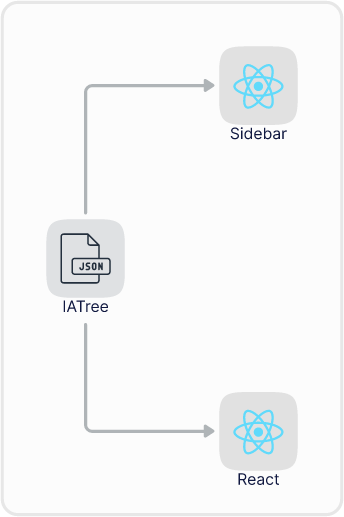
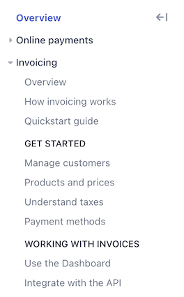

# ia-tree

<!-- IDEA: Rename to @delightfuldocs/ia? -->

`ia-tree` is a specification for representing the information architecture of a website as an abstract syntax tree. It implements the [unist](#) spec.

## Motivation

I've seen a lot of projects come up with data structures for representing the structure of websites and then creating components and utilities to work with those structures.

<!-- TODO: Share some examples (e.g. Tailwind, etc) -->

It's a lot of redundant work!

If a standard data structure can represent the structure of any website, a common set of components and utilities can be used to render and manipulate that structure.

For example, I should be able to pass the same data into different React components — say, a `Sidebar` component and a `Breadcrumbs` component — and have both render with sensible defaults.



<!-- TODO: Move ia-tree-builder into separate package -->
<!-- TODO: ia-tree-navigation-utils -->
<!-- TODO: Move type guards into `ia-tree-node-is` package -->

## Install

```bash
npm install @delightfuldocs/ia-tree
# yarn add @delightfuldocs/ia-tree
```

## Usage

1. Import the package:

   ```typescript
   // ESM
   import { root, group, page } from "@delightfuldocs/ia-tree";

   // CJS
   const { root, group, page } = require("@delightfuldocs/ia-tree");
   ```

2. Create a tree:

   ```typescript
   const tree = root([
     group("Getting started", [
       page("overview", "Overview"),
       page("quick-start", "Quick start"),
       page("changelog", "Changelog"),
     ]),
   ]);
   ```

3. Use [unist utilities](#) to interact with the tree:

   ```typescript
   import { root, group, page } from "@delightfuldocs/ia-tree";
   import { visit } from "unist-util-visit";

   const tree = root([
     group("Getting started", [
       page("overview", "Overview"),
       page("quick-start", "Quick start"),
       page("changelog", "Changelog"),
     ]),
   ]);

   visit(tree, (node) => {
     console.log(node);
   });
   ```

## API reference

### Builders

Helper functions for creating a valid tree.

#### `group(label: string, children: Child[]) => Group`

Creates a `Group` node.

##### Parameters

- `label` - A human readable label for the group.
- `children` - The nodes that exist within the group.

##### Returns

`Group`

#### `root(children: Child[]) => Root`

Creates a `Root` node.

### Type guards

Functions for checking if something is a node (or a certain type of node). These are particularly useful if you're using unist utilities, such as `unist-util-visit` to navigate a tree and only want to manipulate certain nodes.

#### `isChild(data: any) => boolean`

Returns `true` if `data` is a `Child` node.

#### `isGroup(data: any) => boolean`

Returns `true` if `data` is a `Group` node.

### Types

The type definitions of the nodes that can exist within a tree.

#### `Child`

```typescript
type Child = Group | Link | Page | Section;
```

Represents any node that can be a child of a `Parent` node. The only node that can't be a child is the `Root` node.

#### `Group`

```typescript
type Group = {
  type: "group";
  label: string;
  children: Child[];
};
```

Represents a group of nodes. The `Group` node itself is _not_ associated with a web page. It's simply a collection of nodes assigned a label.

For example, in the Stripe documentation, sidebar labels like _Online payments_, _Invoicing_, _Get started_, and _Working with invoices_ are equivalent to groups:



#### `Link`

```typescript
type Link = {
  type: "link";
  url: string;
  label: string;
};
```

Represents a link to an external web page.

#### `Page`

```typescript
type Page = {
  type: "page";
  id: string;
  label: string;
  children?: Child[];
};
```

Represents a page of content that exists within the information architecture. The page can optionally have sub-pages via the `children` property.

#### `Parent`

```typescript
type Parent = Group | Page | Root | Section;
```

Represents any node that can have children. The only nodes that can't have children are `Link` nodes. It's not required for `Page` nodes to have children.

#### `Root`

```typescript
type Root = {
  type: "root";
  children: Child[];
};
```

Represents the root node of an information architecture. It can only be used at the root node of a tree. All other nodes can be a descendant of a `Root` node.

#### `Section`

```typescript
type Section = {
  type: "section";
  id: string;
  label: string;
  children: Child[];
};
```

Represents a distinct section within an information architecture. The `Section` node itself _is_ associated with a page in the information architecture.

When users view a section's page, or a page that exists within a section, the intent is for the primary navigation to only contain pages belonging to that section.

For example, in Stripe's documentation, the _Payments_ or _Business operations_ pages each have their own sidebars. These could be represented as sections.

## Utilities

- `ia-tree-get-breadcrumbs`
- `ia-tree-get-section`
